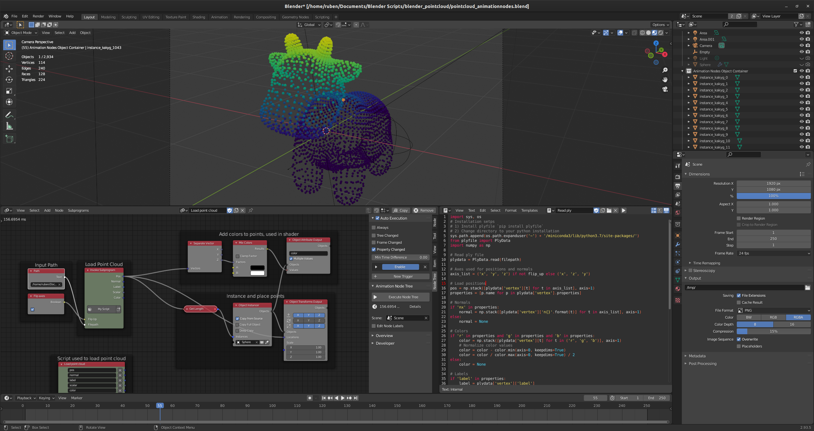

# Point Clouds in Blender + Animation Nodes
This blender file helps you load in point clouds with animation nodes and provides a starting point to render your own beautiful point clouds in Blender.

## What it does
A script in Animation Nodes loads the point cloud from a `.ply` file and checks if normals, colors, or scalars are available. It then instances spheres at the point locations and lets the user link the attributes from the ply file to attributes of the spheres (such as color used in shading). You can change the sphere into anything you'd like and expand the script to load from numpy files or other data types that store point clouds.

## How to use
1. Download the [Animation Nodes plugin](https://animation-nodes.com/) and install the plugin in Blender
2. Install plyfile in your python installation: `pip install plyfile`
3. Open the `pointcloud_animationnodes.blend` file in Blender and adjust the `Read ply` script so that it has access to your python installation.
4. Input the file path of your ply file in the `Input Path` frame in Animation Nodes.
5. You should now see something like the following screen:
 
